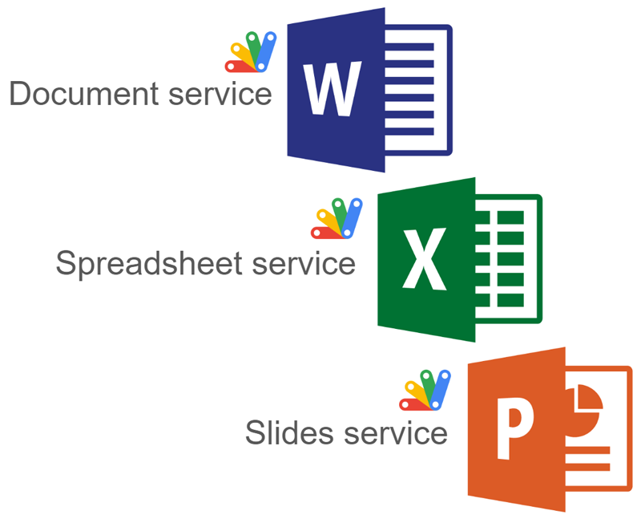

# MicrosoftDocsApp

<a name="top"></a>
[MIT License](LICENCE)

<a name="overview"></a>

# Overview

This is a Google Apps Script library for using Microsoft Docs files (Word, Excel, and PowerPoint files) using [Document service](https://developers.google.com/apps-script/reference/document), [Spreadsheet service](https://developers.google.com/apps-script/reference/spreadsheet), and [Slides Service](https://developers.google.com/apps-script/reference/slides) of Google Apps Script.



<a name="description"></a>

# Description

Recently, Microsoft Docs files (Word, Excel, and PowerPoint files) could be manually edited by opening it on Google Drive using the browser. This is good news for a lot of users. With this situation, the URLs of Microsoft Docs files were changed. For example, when a Microsoft Word file (DOCX) is opened on Google Drive with the browser, the URL is `https://docs.google.com/document/d/###/edit`. `###` of this URL is the file ID of the DOCX file on Google Drive. This URL is the same as that of Google Document while the length of the file ID is different. From this situation, it might be guessed that the Document service of Google Apps Script might be able to be used for DOCX files.

Recently, I sometimes saw this situation at Stackoverflow. However, unfortunately, in the current stage, Microsoft Docs files cannot be directly used with the Document service, Spreadsheet service, and Slides Service of Google Apps Script. Fortunately, when Microsoft Docs files are converted to Google Docs files, those services can be used. I'm worried that this process might be a bit complicated for users.

So, I created this library MicrosoftDocsApp. When MicrosoftDocsApp is used, Microsoft Docs files can be used with Document service, Spreadsheet service, and Slides Service of Google Apps Script using a simple script.

# Library's project key

```
1B0eoHz03BVtSZhJAocaGNq94RjoXocz8xGMaLzwVdmAvYW5k8s5Yd360
```

<a name="usage"></a>

# Usage

## 1. Install library

In order to use this library, please install the library as follows.

1. Create a GAS project.

   - You can use this library for the GAS project of both the standalone and container-bound script types.

1. [Install this library](https://developers.google.com/apps-script/guides/libraries).

   - Library's project key is **`1B0eoHz03BVtSZhJAocaGNq94RjoXocz8xGMaLzwVdmAvYW5k8s5Yd360`**.

# Scopes

This library uses the following 2 scopes.

- `https://www.googleapis.com/auth/script.external_request`
- `https://www.googleapis.com/auth/drive`

However, when you want to use DOCX file with Document service, a scope of `https://www.googleapis.com/auth/documents` is required to be used. Similarly, when you want to use XLSX and PPTX files with Spreadsheet and Slides service, respectively, the scopes of `https://www.googleapis.com/auth/spreadsheets` and `https://www.googleapis.com/auth/presentations` are required to be used. In the following sample scripts, the scopes are also considered. Please don't worry.

# API

This library uses Drive API v3. If an error is related to Drive API, please enable Drive API v3 at Advanced Google services.

# IMPORTANT

When Microsoft Docs files (Word, Excel, and PowerPoint files) are updated, this library overwrites Microsoft Docs files. So, I would like to recommend testing this library after you back up your original files.

# Limitations

- In the current stage, Microsoft Docs files are not completely same with Google Docs files. When Microsoft Docs files are updated using Document service, Spreadsheet service, and Slides service, there might be a situation that the updated result is completely same between Microsoft Docs files and Google Docs files.

# Methods

| Methods                           | Description                                                              |
| :-------------------------------- | :----------------------------------------------------------------------- |
| [setFileId](#setfileid)           | Set file ID of Microsoft Docs files (Word, Excel, and PowerPoint files)  |
| [getDocument](#getdocument)       | Get Class Document of Document converted from Word file.                 |
| [getSpreadsheet](#getspreadsheet) | Get Class Spreadsheet of Spreadsheet converted from Excel file.          |
| [getSlide](#getslide)             | Get Class Presentation of Presentation converted from PowerPoint file.   |
| [saveAndClose](#saveandclose)     | If you write something, Microsoft Docs files are updated by this method. |
| [end](#end)                       | Temporal file of converted Google Docs file is deleted.                  |

In this library, the auto-completion can be used as follows.


<a name="setfileid"></a>

## setFileId

Set file ID of Microsoft Docs files (Word, Excel, and PowerPoint files)

Sample script is as follows.

```javascript
const fileId = "###"; // File ID of one of Microsoft Docs files (Word, Excel, and PowerPoint files)
const MD = MicrosoftDocsApp.setFileId(fileId);
```

<a name="getdocument"></a>

## getDocument

Get Class Document of Document converted from Word file.

Sample script is as follows.

If you want to only get values from DOCX file, you can use the following sample script.

```javascript
function sample() {
  const fileId = "###"; // File ID of DOCX file.

  const MD = MicrosoftDocsApp.setFileId(fileId);
  const doc = MD.getDocument();

  const res = doc.getBody().getText();
  console.log(res);
  MD.end();

  // DocumentApp.getActiveDocument(); // This comment line is used for automatically detecting a scope "https://www.googleapis.com/auth/documents" by the script editor. So, please don't remove this comment line.
}
```

If you want to put values to DOCX file, you can use the following sample script. In this case, please use `saveAndClose()`. By this, DOCX file is updated.

```javascript
function sample() {
  const fileId = "###"; // File ID of DOCX file.

  const MD = MicrosoftDocsApp.setFileId(fileId);
  const doc = MD.getDocument();

  const body = doc.getBody();
  body.appendParagraph("sample");
  MD.saveAndClose();
  MD.end();

  // DocumentApp.getActiveDocument(); // This comment line is used for automatically detecting a scope "https://www.googleapis.com/auth/documents" by the script editor. So, please don't remove this comment line.
}
```

<a name="getspreadsheet"></a>

## getSpreadsheet

Get Class Spreadsheet of Spreadsheet converted from Excel file.

Sample script is as follows.

If you want to only get values from XLSX file, you can use the following sample script.

```javascript
function sample() {
  const fileId = "###"; // File ID of XLSX file.

  const MD = MicrosoftDocsApp.setFileId(fileId);
  const ss = MD.getSpreadsheet();

  const res = ss.getSheets()[0].getDataRange().getValues();
  console.log(res);
  MD.end();

  // SpreadsheetApp.getActiveSpreadsheet(); // This comment line is used for automatically detecting a scope "https://www.googleapis.com/auth/spreadsheets" by the script editor. So, please don't remove this comment line.
}
```

If you want to put values to XLSX file, you can use the following sample script. In this case, please use `saveAndClose()`. By this, XLSX file is updated.

```javascript
function sample() {
  const fileId = "###"; // File ID of XLSX file.

  const MD = MicrosoftDocsApp.setFileId(fileId);
  const ss = MD.getSpreadsheet();

  ss.getSheets()[0].appendRow([new Date(), "sample"]);
  MD.saveAndClose();
  MD.end();

  // SpreadsheetApp.getActiveSpreadsheet(); // This comment line is used for automatically detecting a scope "https://www.googleapis.com/auth/spreadsheets" by the script editor. So, please don't remove this comment line.
}
```

<a name="getslide"></a>

## getSlide

Get Class Presentation of Presentation converted from PowerPoint file.

Sample script is as follows.

If you want to only get values from PPTX file, you can use the following sample script. In this case, a text is retrieved from a shape on the first slide.

```javascript
function sample() {
  const fileId = "###"; // File ID of PPTX file.

  const MD = MicrosoftDocsApp.setFileId(fileId);
  const s = MD.getSlide();

  const res = s.getSlides()[0].getShapes()[0].getText().asString();
  console.log(res);
  MD.end();

  // SlidesApp.getActivePresentation(); // This comment line is used for automatically detecting a scope "https://www.googleapis.com/auth/presentations" by the script editor. So, please don't remove this comment line.
}
```

If you want to put values to PPTX file, you can use the following sample script. In this case, please use `saveAndClose()`. By this, PPTX file is updated.

```javascript
function sample() {
  const fileId = "###"; // File ID of PPTX file.

  const MD = MicrosoftDocsApp.setFileId(fileId);
  const s = MD.getSlide();

  s.getSlides()[0]
    .insertShape(SlidesApp.ShapeType.RECTANGLE, 0, 0, 100, 100)
    .getText()
    .setText("new text");
  MD.saveAndClose();
  MD.end();

  // SlidesApp.getActivePresentation(); // This comment line is used for automatically detecting a scope "https://www.googleapis.com/auth/presentations" by the script editor. So, please don't remove this comment line.
}
```

- In this script, a rectangle shape including a text is created to the first slide.

<a name="saveandclose"></a>

## saveAndClose

If you write something, Microsoft Docs files are updated by this method.

You can see how to use this method at the above sample scripts.

<a name="end"></a>

## end

Temporal file of converted Google Docs file is deleted.

You can see how to use this method at the above sample scripts.

---

<a name="licence"></a>

# Licence

[MIT](LICENCE)

<a name="author"></a>

# Author

[Tanaike](https://tanaikech.github.io/about/)

[Donate](https://tanaikech.github.io/donate/)

<a name="updatehistory"></a>

# Update History

- v1.0.0 (December 27, 2023)

  1. Initial release.

[TOP](#top)
